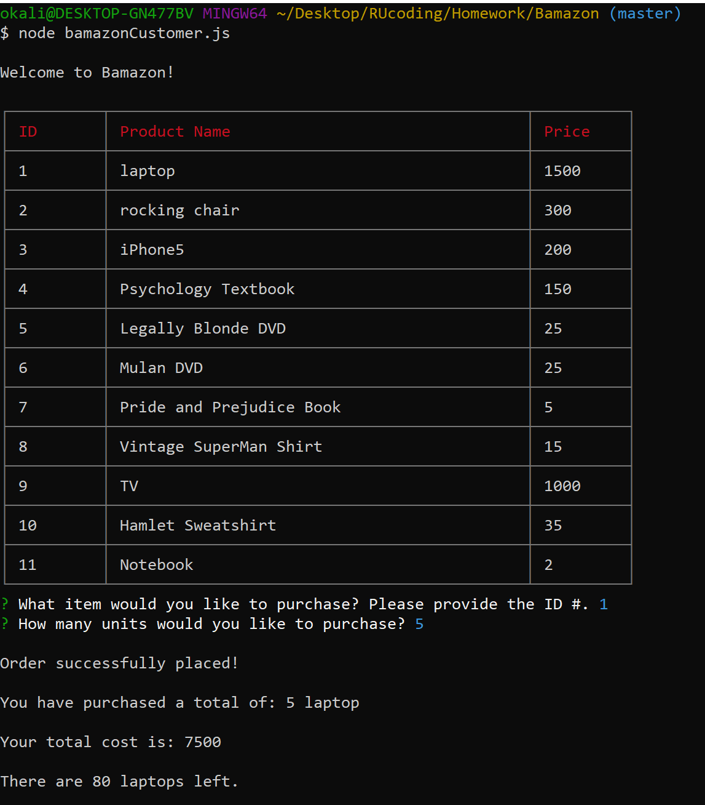
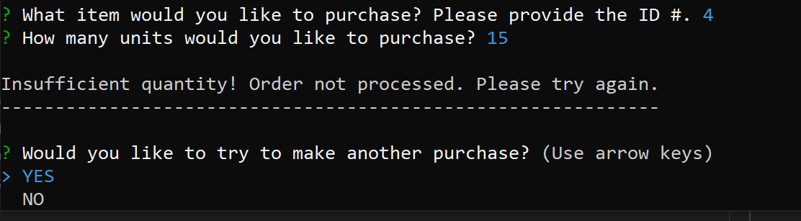

# Bamazon

Bamazon is a node application that uses a mysql database. It is an Amazon-like storefront. The app takes orders from customers and changes the information in the mysql database based on what and how much the customer buys. Additionally, the Manager of Bamazon is able to keep track of their products inventory so they can view what products they have, which products have a low inventory, add to the current inventories as well as add additional products.

Example of Bamazon: https://youtu.be/VIHh1b3DWKU

##Technologies Used

Built with mysql database and used three NPM packages(NPM INQUIRER, NPM MYSQL, AND NPM CLI TABLE)

## Bamazon Customer

Bamazon Customer displays a table with the products information from the mysql database. The table includes item_id, product_name, department_name, price, and stock_quantity, however, the customer is only shown a table with the item_id, product_name, and price. The customer is then promoted what item they would like to buy. Once they answer, then they are promoted with another question asking how many units they would like to purchase. If the customer picks an amount equal or under the stock_quantity, the order is successfully placed and mysql database is updated to reflect the current inventory.

If the customer wants to buy more stock than is available, the order will not go through and the customer will be prompted again.

